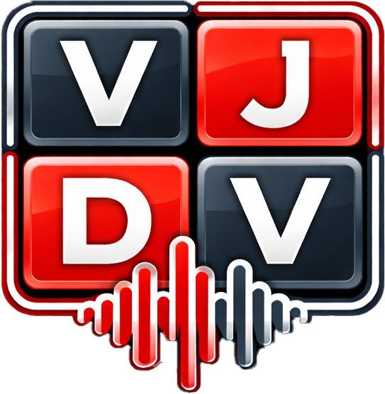
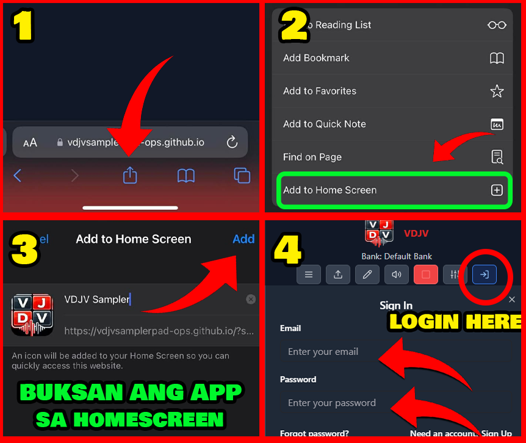
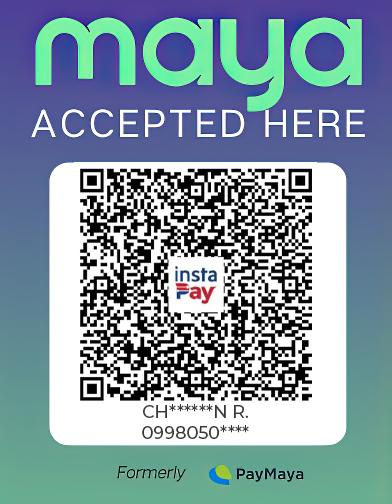

<p align="center">
  
</p>

<h1 align="center">VDJV Sampler Pad</h1>

<p align="center">
  🎛️ Cross-platform sampler pad for Web, Android, Windows, iOS shortcut install, and macOS web access.
</p>

<p align="center">
  <a href="https://vdjvsamplerpad.online/">
    
  </a>
  <a href="https://github.com/vdjvsamplerpad/vdjvsamplerpad.github.io/releases/latest">
    
  </a>
  <a href="LICENSE">
    
  </a>
</p>

## ✨ Overview

VDJV Sampler Pad is a browser-first sampler app built for fast triggering, bank management, online downloads, and cross-platform distribution.  
This repository powers the live web app, Android builds through Capacitor, and Windows desktop builds through Electron.

## ⚡ Quick Download

<p align="center">
  <a href="https://github.com/vdjvsamplerpad/vdjvsamplerpad.github.io/releases/download/v0.1.0/vdjv-sampler-pad-v0.1.0-android.apk">
    
  </a>
  <a href="https://github.com/vdjvsamplerpad/vdjvsamplerpad.github.io/releases/download/v0.1.0/vdjv-sampler-pad-v0.1.0-windows.exe">
    
  </a>
  <a href="https://vdjvsamplerpad.github.io/ios/">
    
  </a>
  <a href="https://vdjvsamplerpad.github.io/vdjv/">
    
  </a>
</p>

## 🎯 Core Features

- 🎵 Pad-based sampler playback
- 🗂️ Bank create, duplicate, import, and export flows
- ☁️ Online bank catalog and download flow
- 🛠️ Admin publish and catalog tools
- 📱 PWA support for web install
- 🤖 Android packaging through Capacitor
- 🖥️ Windows packaging through Electron
- 🧾 Receipt OCR support

## 🌐 Socials

<p align="center">
  <a href="https://www.facebook.com/vdjvsampler">
    
  </a>
  <a href="https://www.facebook.com/share/g/14esJ28V16J/">
    
  </a>
  <a href="https://www.youtube.com/@powerworkout563">
    
  </a>
  <a href="https://www.instagram.com/vdjvsamplerpad">
    
  </a>
</p>


## 🍎 iOS Add To Home Screen

For iPhone and iPad users, use the install guide below:

<p align="center">
  <a href="https://vdjvsamplerpad.github.io/ios/">
    
  </a>
</p>

## 🧱 Tech Stack

- React 18
- TypeScript
- Vite
- Tailwind CSS
- Supabase
- Capacitor Android
- Electron

## 📁 Project Structure

```text
client/               Frontend app
server/               Local server and static helpers
electron/             Electron main and preload process
android/              Capacitor Android project
supabase/functions/   Supabase Edge Functions
supabase/migrations/  Database migration history
scripts/              Build and maintenance scripts
docs/                 Release and deployment checklist
```

## 🚀 Local Development

Requirements:

- Node.js 18+
- npm 8+

Install dependencies:

```bash
npm install
```

Run local development:

```bash
npm run dev
```

Run the local helper server/watch flow:

```bash
npm run start
```

## 🛠️ Common Commands

```bash
npm run type-check
npm run build
npm run test
npm run lint
```

Web build:

```bash
npm run build
```

Android sync:

```bash
npm run cap:sync
```

Android release APK:

```bash
npm run cap:build:android:apk
```

Android release AAB:

```bash
npm run cap:build:android
```

Electron package build:

```bash
npm run build:electron:package
```

## 🔐 Environment

Frontend public env:

- `VITE_SUPABASE_URL`
- `VITE_SUPABASE_ANON_KEY`

Reference files:

- [.env.example](.env.example)
- [supabase/functions/.env.example](supabase/functions/.env.example)

Android release signing is read from:

- `ANDROID_RELEASE_KEYSTORE_PATH`
- `ANDROID_RELEASE_KEYSTORE_PASSWORD`
- `ANDROID_RELEASE_KEY_ALIAS`
- `ANDROID_RELEASE_KEY_PASSWORD`

Keep signing material outside the repository.

## 🍚 Buy Me Lugaw

If the app helps you and you want to support development, you can send a small tip here.

<table>
  <tr>
    <td align="center">
      <strong>GCash</strong><br>
      
    </td>
    <td align="center">
      <strong>Maya</strong><br>
      
    </td>
  </tr>
</table>

## 📌 Release Notes

- Web app is deployed through GitHub Pages
- Android builds are packaged through Capacitor
- Windows installers are packaged through Electron

## 📄 License

This project is licensed under the MIT License. See [LICENSE](LICENSE).
